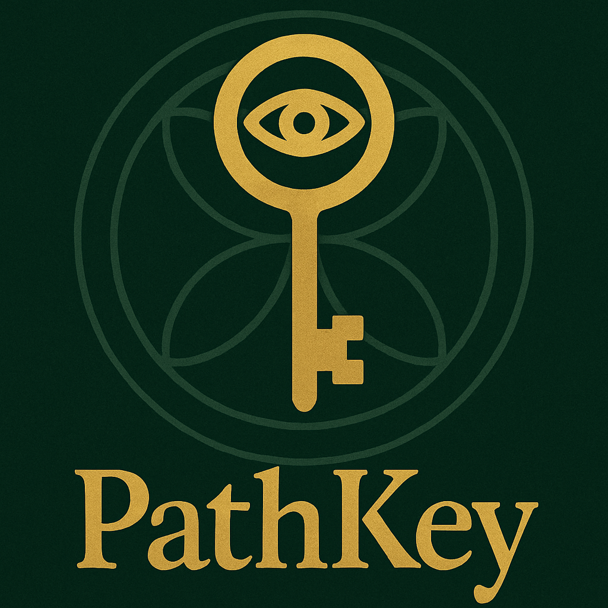

<p align="center">
  
</p>

# PathKey™ Desktop

PathKey™ Desktop is a cross-platform application built with [Tauri](https://tauri.app/) that runs the PathKey™ web interface in a secure, native wrapper.  
It provides a lightweight, offline-friendly way to access the PathKey Console without relying on a browser.

---

## ✨ Features

- 🔑 **PathKey Console UI** — Runs the [PathKey web shell](./src/index.html) inside a native app window.  
- 📦 **Cross-platform** — Works on Linux, macOS, and Windows.  
- 🪶 **Lightweight** — Built with Tauri 2.x (Rust backend + webview frontend).  
- 🎨 **Brand styling** — Uses the PathKey dark green / gold palette:
  - `#042316` (dark green)  
  - `#1f3f2b` (light green)  
  - `#cca242` (gold)  

---

## 🚀 Getting Started

### Prerequisites
- [Rust](https://www.rust-lang.org/) (latest stable)
- [Node.js](https://nodejs.org/) (v18+ recommended)
- [pnpm](https://pnpm.io/) or npm/yarn

### Install dependencies
```bash
pnpm install
```

### Run in development
```bash
pnpm tauri dev
```

### Build release binaries
```bash
pnpm tauri build
```
The build artifacts will be available in `src-tauri/target/release/`.

---

## 🧩 Project Structure

```
.
├── src/                  # Frontend (HTML/CSS/JS)
│   └── index.html        # PathKey Console UI shell
├── src-tauri/            # Rust + Tauri configuration
│   ├── Cargo.toml
│   └── tauri.conf.json
├── public/               # App icons and assets
│   └── icon.png
├── README.md
├── LICENSE               # Umbrella license (explains dual-licensing)
├── LICENSE-MIT           # MIT license for upstream Tauri code
├── LICENSE-PATHKEY       # Proprietary license for PathKey™ additions
└── NOTICE                # Attribution / credits
```

---

## 📖 About PathKey™

The MyPathKey™ console is a numerology-inspired calculator that computes **Path Number**, **Master Number**, and **Daily Number** based on your birthdate.  
The web UI is styled and functional as a static shell, and the Tauri app wires this frontend into the PathKey Engine.

---

## ⚖️ License

This project is **dual-licensed**:

- Portions derived from upstream Tauri code are licensed under the [MIT License](./LICENSE-MIT).
- PathKey™ code, branding, and additions are licensed under the [PathKey™ Proprietary License](./LICENSE-PATHKEY).

See [LICENSE](./LICENSE) and [NOTICE](./NOTICE) for details.

© 2025 MyPathKey™, PathKey™.
All rights reserved.